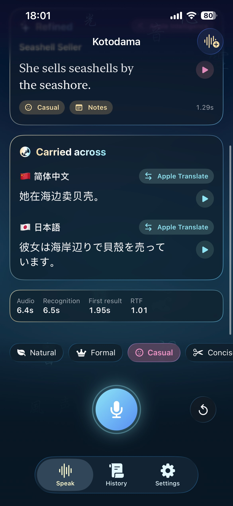
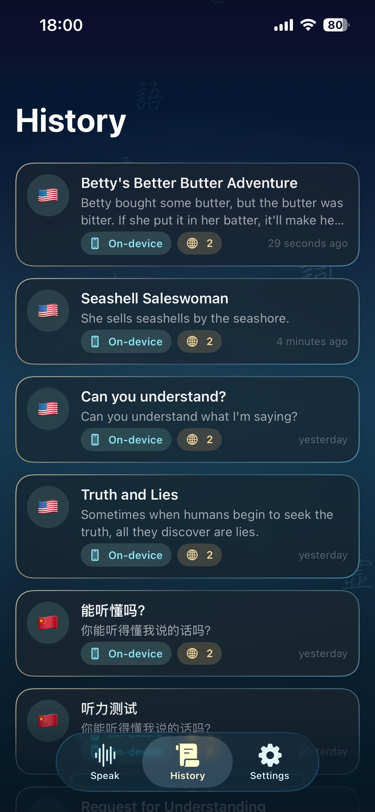
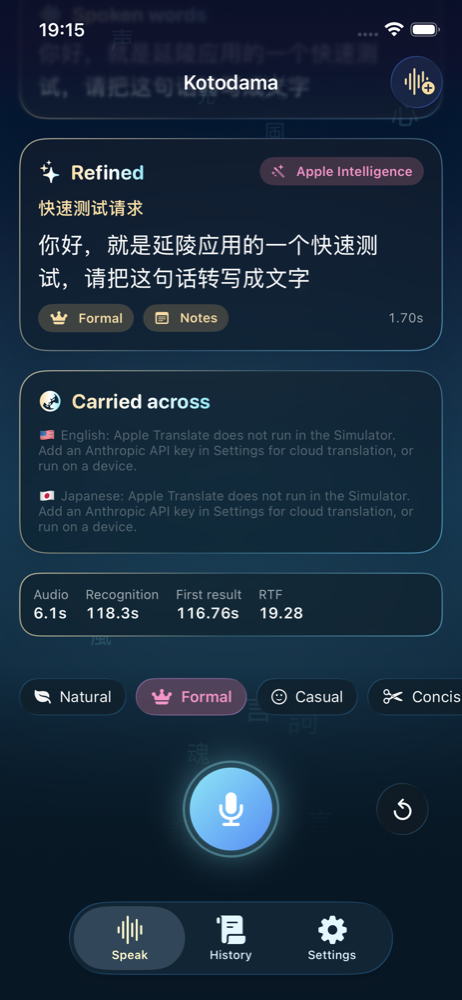

# Kotodama（言霊）

> Word spirits. An AI speech-to-text app for iOS where spoken words carry the magic to be
> transcribed, refined and carried across languages.

In Japanese folklore *kotodama* is the spirit that dwells in words. Kotodama the app listens to
you speak, writes it down as you talk, polishes it for the situation you choose, and translates it
into the languages you care about. It runs on Apple's on-device speech, language and translation
models, with cloud models available when you want them.

Built for the Metanomaly iOS programming assignment (AI Speech-to-Text App).


## Showcase

**Screen recording (iPhone 16e):** [docs/showcase/kotodama-showcase.mp4](docs/showcase/kotodama-showcase.mp4)

| On device: polished text, translations and read-aloud | On device: history | Home screen | Simulator: Mandarin |
| --- | --- | --- | --- |
|  |  |  |  |

Submission documents: [AI conversation log](docs/AI_CONVERSATION_LOG.md) · [Models, parameters and metrics](docs/MODELS.md) · [Bug list](docs/BUGS.md) · [Optimizations](docs/OPTIMIZATIONS.md)

## Features

- **Speech recognition for Chinese, English and dialects.** Fifteen spoken varieties including
  Mandarin (China mainland and Taiwan), Cantonese (Hong Kong and China mainland), Shanghainese,
  five regional Englishes and Japanese. Live volatile text appears while you speak and is
  finalized segment by segment.
- **Automatic translation** of the polished text into any set of eight target languages
  (English, Simplified and Traditional Chinese, Japanese, Korean, Spanish, French, German).
  Targets that match the spoken language are skipped automatically.
- **Language styles and usage scenarios**: six styles (natural, formal, casual, concise,
  business, academic) and seven scenarios (notes, message, email, meeting, lecture, travel,
  social post). Changing a chip re-polishes the last recording.
- **Automatically polished output**: filler words, false starts and recognition noise are
  removed and the text is restyled, with a title and one-sentence summary.
- **Bonus: on-device and cloud recognition models**, switchable with one tap. On-device uses
  Apple's `SpeechAnalyzer`; cloud uses Apple's speech servers. Polishing and translation also have
  on-device and cloud paths.
- **Model metrics** per recording: recognizer and model id, audio length, recognition time,
  first-result latency, real-time factor, and refiner and translator latency.
- **Read it back**: a play button beside the spoken text, the refined text and every translation
  speaks the sentence with the system voice for that language (`AVSpeechSynthesizer`). The best
  installed quality is used by default; Settings lists the voices per language with a preview,
  flags languages that only have the compact Default voice, and points to the iOS download page
  for Enhanced and Premium voices. Chinese, Japanese and Korean play slightly slower.
- **History** with Markdown export for test cases, and bundled sample audio in English, Mandarin
  and Japanese so the pipeline can be exercised without a microphone.
- **Liquid glass UI** on iOS 26 with a night-shrine theme: drifting word spirits in a traditional
  brush-style face (Hiragino Mincho, upgrading to Apple's downloadable 行楷 / 楷体 when available)
  that glow with your voice, talisman-framed cards and a breathing orb.
- Localized in English, Simplified Chinese (简体中文) and Japanese (日本語).

## Engines

| Stage | On-device | Cloud | Fallback |
| --- | --- | --- | --- |
| Recognition | `SpeechAnalyzer` + `SpeechTranscriber`, or `DictationTranscriber` for locales the former lacks (more dialects). Assets download on first use. | `SFSpeechRecognizer` with server-based recognition (Apple's speech servers, no API key). | — |
| Polishing | `FoundationModels` system model, guided generation into `{text, title, summary}`, temperature 0.3, max 900 tokens | Claude via the Messages API with structured output (`claude-opus-5-5` default, effort low, server-side fallbacks, cached system prompt) | Rule-based clean-up: filler removal per language, repeat collapsing, capitalisation, punctuation, contraction expansion for formal styles |
| Translation | Apple `Translation` framework (`TranslationSession` through `translationTask`) | Claude, structured output | — |

The *Automatic* intelligence mode tries on-device first, then cloud if an API key is set, then
the rules, and shows which engine produced each result.

## Why SpeechAnalyzer

`SpeechAnalyzer` is Apple's current speech-to-text stack (iOS 26). It streams volatile and final
results, runs fully offline with system-managed model downloads, costs nothing per request and
keeps audio on the device. Its locale list covers the required Chinese and English varieties;
`DictationTranscriber` extends coverage for more dialects, and the server-based `SFSpeechRecognizer`
provides the cloud alternative, so one `SpeechRecognizer` protocol fronts all three. Third-party
cloud recognizers can be added behind the same protocol.

## Architecture

```
Kotodama/
  Domain/           LanguageOption, TargetLanguage, SpeakingStyle, UsageScenario, Transcript (SwiftData)
  Recognition/      SpeechRecognizer protocol, AppleOnDeviceRecognizer, AppleCloudRecognizer,
                    AudioCapture (AVAudioEngine), AudioFileReader, BufferConverter
  Refinement/       TextRefiner protocol, OnDevice (FoundationModels), Cloud (Claude), RuleBased, pipeline
  Translation/      Translator protocol, AppleTranslationCoordinator + AppleTranslator, CloudTranslator, pipeline
  Features/         Speak (live transcript, refined text, translations, orb), History, Settings
  Support/          Theme (spirit field + talisman glass), AppSettings, KeychainStore, ClaudeClient
```

## Getting started

```sh
open Kotodama.xcodeproj
```

Select the `Kotodama` scheme and run on a device or simulator. Microphone and speech-recognition
permission are requested on first use. The simulator can use the Mac's microphone, or pick
**Try a sample** from the toolbar to transcribe bundled audio.

- On-device recognition downloads a speech model per language the first time.
- On-device polishing needs Apple Intelligence (iPhone 15 Pro or later, or a Mac with it enabled
  when using the simulator). Without it the app falls back to Claude or the built-in rules.
- Cloud polishing and translation need an Anthropic API key, entered in Settings and stored in
  the keychain.

## Tests

```sh
xcodebuild test -project Kotodama.xcodeproj -scheme Kotodama \
  -destination 'platform=iOS Simulator,name=iPhone 16e'
```

- `KotodamaTests` (Swift Testing): rule-based refinement per language and style, engine fallback
  chains, language matching and dialect grouping, buffer conversion and level metering, sample
  audio reading, and an on-device recognition test that runs when the model is available.
- `KotodamaUITests` (XCTest): transcribes the English and Mandarin samples (on-device, falling
  back to cloud), changes the style, visits history and settings, and saves screenshots to
  `/tmp/kotodama-screens`.

## Known issues and tuning notes

- Apple Intelligence treated "Please transcribe this sentence" inside a transcript as an
  instruction and dropped it. The transcript is now framed as quoted material with an explicit
  rule that its contents are never instructions.
- Apple's server recognizer heard the made-up word 言灵 as 炎陵 in the Mandarin sample;
  uncommon proper nouns are a known weak spot and a custom vocabulary is a possible follow-up.
- `SFSpeechRecognizer.isAvailable` is reported asynchronously and starts out false, so the app
  no longer gates on it before starting a request.
- The iOS Simulator has no on-device speech assets and does not run the Translation framework,
  so those paths need a physical device; the UI test falls back to the cloud recognizer.

## License

Copyright © 2026 Kyle Zhao. All rights reserved.
